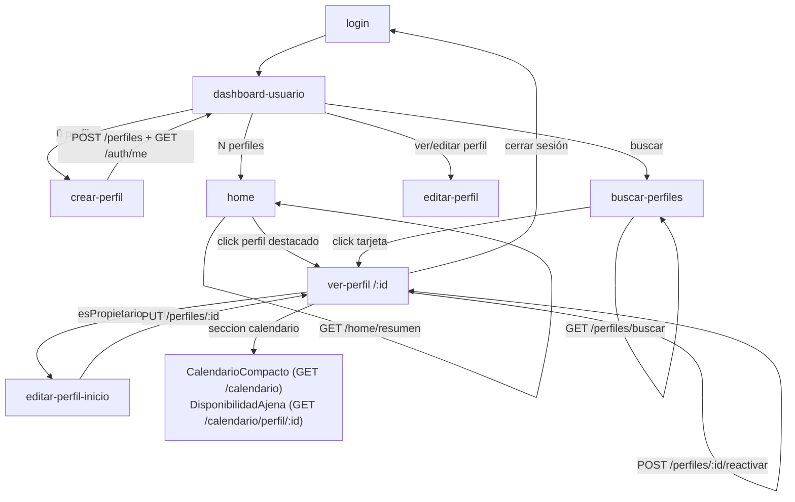

# Ficha Técnica Inversa — Módulo `src/views/perfil`

> **Tipo:** Documento inverso (Frontend → Backend).
> **Objetivo:** Inventariar el flujo de pantallas del módulo de perfil y detallar qué **clases/componentes Vue**, **servicios**, **atributos** y **endpoints del backend** consume el frontend, para facilitar la adaptación de la base de datos / contrato del backend.
> **Alcance inicial:** `C:\Users\HP\Desktop\modalink-frontend\src\views\perfil` (5 vistas) y sus dependencias directas de servicios y componentes.
> **Fecha:** 2026-10-03

---

## 1. Resumen ejecutivo

El módulo `src/views/perfil` está compuesto por **5 vistas Vue 3 (Options API)** que cubren: feed de inicio, creación de perfil, edición de perfil, visualización/detalle de perfil y búsqueda de perfiles. Todas las peticiones salen a través de un único cliente axios (`src/services/http.js`) y se reparten en **4 servicios frontend** principales: `perfilService`, `homeService`, `calendarioService` y `authService`.

- **Endpoints backend consumidos por el módulo:** `7` (perfilService) + `2` (homeService) + `4` (calendarioService, vía componentes) + `2` (authService/authState) = **15 endpoints**.
- **Base URL configurada:** `http://localhost:8080` (hardcodeada en `http.js`).
- **Autenticación:** cookies `HttpOnly` (`withCredentials: true`) + CSRF (`XSRF-TOKEN` → header `X-XSRF-TOKEN`).

---

## 2. Inventario de pantallas / rutas del módulo

| # | Vista (`clase`) | Archivo | Ruta(s) | Nombre de ruta | Layout | Meta relevante |
|:-:|:--|:--|:--|:--|:--|:--|
| 1 | `HomeView` | `HomeView.vue` | `/home` | `home` | `HomeLayout` | `requiresActiveProfile: true` |
| 2 | `BuscarPerfilView` | `BuscarPerfilView.vue` | `/buscar-perfiles` | `buscar-perfiles` | `HomeLayout` | `requiresActiveProfile: true` |
| 3 | `CrearPerfilView` | `CrearPerfilView.vue` | `/dashboard-usuario/crear-perfil` | `crear-perfil` | `UserDashboardLayout` | `sinPerfilActivo: true` |
| 4 | `EditarPerfilView` | `EditarPerfilView.vue` | `/dashboard-usuario/editar-perfil/:id` y `/inicio-perfil/editar/:id` | `editar-perfil` / `editar-perfil-inicio` | `UserDashboardLayout` / `HomeLayout` | `permiteSinPerfil` / `desdeInicio: true` |
| 5 | `InicioPerfilView` | `InicioPerfilView.vue` | `/inicio-perfil`, `/inicio-perfil/:seccion`, `/perfiles/:id`, `/perfiles/:id/:seccion` | `inicioperfil`, `inicioperfil-seccion`, `ver-perfil`, `ver-perfil-seccion` | `HomeLayout` | `requiresActiveProfile`, `sinSidebarPerfil`, `sinFondoBlanco` |

> Guard de navegación relevante (`src/router/index.js:165`): con layout `HomeLayout`/`UserDashboardLayout` y sin perfil activo en sesión, se consulta `GET /usuarios/me/perfiles`; si está vacío redirige a `crear-perfil`, si tiene perfiles redirige a `dashboard-usuario`.

---

## 3. Flujo de pantallas (navegación)



**Flujo de datos por navegación de sección (InicioPerfilView):**
- Secciones válidas: `calendario`, `resenas`; cualquier otra cae en `publicaciones` (default).
- Perfil propio → `CalendarioCompacto` (`GET /calendario`) + `ProximosEventos` (`GET /calendario`).
- Perfil ajeno → `DisponibilidadAjena` (`GET /calendario/perfil/{id}`) + `ResenasCard` (props, sin endpoint).

---

## 4. Servicios frontend involucrados

| Servicio (`clase/objeto`) | Archivo | Métodos usados por el módulo | Endpoint base |
|:--|:--|:--|:--|
| `perfilService` | `src/services/perfilService.js` | `listarMisPerfiles`, `crear`, `obtener`, `editar`, `reactivar`, `listarProfesiones`, `buscar`, `caracteristicasPorProfesion` | `/perfiles`, `/profesiones`, `/usuarios/me/perfiles` |
| `homeService` | `src/services/homeService.js` | `obtenerResumen`, `obtenerPerfilActivo` | `/home/resumen`, `/perfiles/activo` |
| `calendarioService` | `src/services/calendarioService.js` | `obtenerCalendario`, `obtenerCalendarioPerfil` | `/calendario` |
| `authService` | `src/services/authService.js` | `cerrarSesion` | `/auth/logout` |
| `authState` | `src/services/authState.js` | `setPerfilActivo`, `idPerfilActivo`, `refrescarSesion`, `limpiarSesion` | internamente `GET /auth/me` |
| `http` (axios) | `src/services/http.js` | cliente base, interceptores CSRF | `http://localhost:8080` |

---

## 5. Matriz consolidada de endpoints consumidos

| # | Método | URL | Servicio.Método | Consumido por (vista/componente) | Auth |
|:-:|:--|:--|:--|:--|:-:|
| E1 | GET | `/home/resumen` | `homeService.obtenerResumen()` | `HomeView`, `InicioPerfilView` | Sí |
| E2 | GET | `/perfiles/activo` | `homeService.obtenerPerfilActivo()` | `HomeView` (fallback 404) | Sí |
| E3 | GET | `/perfiles/{idPerfil}` | `perfilService.obtener(id)` | `InicioPerfilView`, `EditarPerfilView` | Sí |
| E4 | GET | `/perfiles/buscar` | `perfilService.buscar(params)` | `BuscarPerfilView` | Sí |
| E5 | POST | `/perfiles` | `perfilService.crear(request)` | `CrearPerfilView` | Sí |
| E6 | PUT | `/perfiles/{idPerfil}` | `perfilService.editar(id, request)` | `EditarPerfilView` | Sí |
| E7 | POST | `/perfiles/{idPerfil}/reactivar` | `perfilService.reactivar(id)` | `InicioPerfilView` | Sí |
| E8 | GET | `/profesiones` | `perfilService.listarProfesiones()` | `BuscarPerfilView`, `CrearPerfilView`, `EditarPerfilView` | Sí |
| E9 | GET | `/profesiones/{idProfesion}/caracteristicas-tecnicas` | `perfilService.caracteristicasPorProfesion(id)` | `CrearPerfilView`, `EditarPerfilView` | Sí |
| E10 | GET | `/usuarios/me/perfiles` | `perfilService.listarMisPerfiles()` | `CrearPerfilView`, router guard | Sí |
| E11 | GET | `/auth/me` | `authState.refrescarSesion()` / `restaurarSesion()` | `CrearPerfilView`, router | Sí |
| E12 | POST | `/auth/logout` | `authService.cerrarSesion()` | `InicioPerfilView` | Sí |
| E13 | GET | `/calendario` | `calendarioService.obtenerCalendario()` | `CalendarioCompacto`, `ProximosEventos` | Sí |
| E14 | GET | `/calendario/perfil/{idPerfil}` | `calendarioService.obtenerCalendarioPerfil(id)` | `DisponibilidadAjena` | Sí |
| E15 | PATCH | `/perfiles/{idPerfil}/activar` | `perfilService.activar(id)` | *(definido en servicio; no invocado en este módulo)* | Sí |

> **Nota:** los endpoints de activación (`activar`), configuración de jornada y bloqueos (`calendarioService.configurarJornada`, `crearBloqueo`, `eliminarBloqueo`) existen en los servicios pero **no se invocan desde `src/views/perfil`** (sí probablemente desde `views/usuario`). Se listan como contexto de contrato.

---

## 6. Detalle por pantalla

### 6.1. `HomeView.vue` — Feed de inicio

- **Ruta:** `/home` → `name: "home"`, layout `HomeLayout`, `requiresActiveProfile: true`.
- **Servicios/endpoints:**
  - E1 `GET /home/resumen` → `homeService.obtenerResumen()`.
  - Fallback en error `404`: E2 `GET /perfiles/activo` → `homeService.obtenerPerfilActivo()`.
- **Estado local:** `perfilActivo`, `proyectos`, `publicaciones`, `cargando`, `mensajeError`.
- **Atributos de respuesta consumidos (E1):**
  | Campo respuesta | Tipo | Uso |
  |:--|:--|:--|
  | `perfilActivo` | object \| null | Guarda perfil activo; se propaga a `authState.setPerfilActivo` |
  | `proyectosDestacados[]` | array | Props a `ProyectosSection` |
  | `proyectosDestacados[].idProyecto` | number | `:key` |
  | `proyectosDestacados[].nombre` | string | Título tarjeta |
  | `proyectosDestacados[].descripcion` | string | Texto tarjeta (opcional) |
  | `publicacionesRecientes[]` | array | Props a `PublicacionesFeed` |
  | `publicacionesRecientes[].idPublicacion` | number | `:key` |
  | `publicacionesRecientes[].contenido` \| `.texto` | string | Cuerpo publicación |
- **Componentes hijos:** `BaseAlert`, `ProyectosSection` (props `proyectos`), `PublicacionesFeed` (props `publicaciones`). Sin endpoints propios.
- **Manejo de error:** `404` → intenta E2; si no hay perfil activo → mensaje `"Seleccioná un perfil desde el dashboard..."`; otros → `"No se pudo cargar el inicio..."`.

---

### 6.2. `BuscarPerfilView.vue` — Búsqueda de perfiles

- **Ruta:** `/buscar-perfiles` → `name: "buscar-perfiles"`, layout `HomeLayout`.
- **Servicios/endpoints:**
  - E8 `GET /profesiones` → `perfilService.listarProfesiones()` (filtro de profesión).
  - E4 `GET /perfiles/buscar` → `perfilService.buscar(params)` (con reintento alterno, ver abajo).
- **Query params enviados a E4 (`buildParams`):**
  | Param | Tipo | Origen / Regla |
  |:--|:--|:--|
  | `page` | integer | Página actual (0-indexed). Se **elimina** si `todos`. |
  | `size` | integer | `20` (default), `50`; se **elimina** y se envía `todos=true` cuando vale `0`. |
  | `todos` | boolean | `true` cuando el usuario elige "Ver todos". |
  | `nombreArtistico` | string | Texto libre del input `q`. |
  | `idProfesion` | long | Selección del combo de profesiones. |
  | `profesion` | string | Reintento: si `nombreArtistico` da 0 resultados y no hay `idProfesion`, se reenvía el texto como `profesion`. |
- **Atributos de respuesta consumidos (E4):**
  - Envelope: `contenido[]`, `paginaActual`, `tamanoPagina`, `totalElementos`, `totalPaginas`, `primera`, `ultima`.
  - Por ítem: `idPerfil`, `nombreArtistico`, `fotoUrl`, `profesion`, `nombreUsuario`, `apellidoUsuario`, `localidad`, `provincia`, `habilidades[]`.
- **Atributos de respuesta consumidos (E8):** array u objeto `{ profesiones: [...] }`; por ítem `idProfesion`, `nombre`.
- **Navegación:** click en tarjeta → `this.$router.push({ name: "ver-perfil", params: { id: perfil.idPerfil } })`.
- **Errores:** `401` → redirect a `login` con `query.redirect`; `403` → mensaje cuenta no habilitada; resto → mensaje genérico.
- **UX:** debounce 350 ms, paginación, limpiar filtros.

---

### 6.3. `CrearPerfilView.vue` — Alta de perfil (wizard 2 pasos)

- **Ruta:** `/dashboard-usuario/crear-perfil` → layout `UserDashboardLayout`, `sinPerfilActivo: true`.
- **Servicios/endpoints:**
  - E8 `GET /profesiones` (`listarProfesiones`).
  - E10 `GET /usuarios/me/perfiles` (`listarMisPerfiles`) — para marcar profesiones ya ocupadas.
  - E9 `GET /profesiones/{idProfesion}/caracteristicas-tecnicas` (`caracteristicasPorProfesion`).
  - E5 `POST /perfiles` (`crear`).
  - E11 `GET /auth/me` (`refrescarSesion`) post-creación.
- **Paso 1:** `nombreArtistico`, `idProfesion`.
- **Paso 2:** características dinámicas por profesión + `biografia`.
- **Atributos de respuesta consumidos (E9) — por característica:**
  | Campo | Tipo | Uso |
  |:--|:--|:--|
  | `idCaracteristica` | long | Clave del mapa `form.caracteristicas` |
  | `codigo` | string | Orden/mapas de etiquetas (p.ej. `altura`, `color_ojos`) |
  | `tipoDato` | string | `"ENUMERADO"` → `VaSelect`; `"NUMERICO"` → input `number`; otro → input `text` |
  | `unidad` | string | Etiqueta `(cm)`, etc. |
  | `valores[]` | array | Opciones para enumerados |
  | `valores[].idValor` | long | `value-by` |
  | `valores[].codigo` | string | Texto de opción |
  | `valores[].colorHex` | string | Swatch de color |
- **Atributos de respuesta consumidos (E10):** por perfil `profesion` (string, para cruzar por nombre con el catálogo de profesiones).
- **Request body (E5):**
  ```json
  {
    "nombreArtistico": "string",
    "idProfesion": 1,
    "biografia": "string",
    "caracteristicas": [
      { "idCaracteristica": 2, "idValor": 14 },
      { "idCaracteristica": 5, "valor": "178" }
    ]
  }
  ```
  - Para `ENUMERADO` se envía `idValor`; para el resto `valor`.
  - Se filtran items vacíos (`idValor != null` o `valor` no vacío).
- **Respuesta esperada / errores:** usa `error.response.data.message` para el mensaje.
- **Post-éxito:** `refrescarSesion()` (E11), mensaje de éxito y redirect `dashboard-usuario` a los 1200 ms.

---

### 6.4. `EditarPerfilView.vue` — Edición de perfil

- **Rutas:** `/dashboard-usuario/editar-perfil/:id` (`editar-perfil`) y `/inicio-perfil/editar/:id` (`editar-perfil-inicio`, `props: { desdeInicio: true }`).
- **Servicios/endpoints:**
  - E3 `GET /perfiles/{idPerfil}` (`obtener`).
  - E8 `GET /profesiones` (`listarProfesiones`) — para resolver `idProfesion` a partir del nombre.
  - E9 `GET /profesiones/{idProfesion}/caracteristicas-tecnicas`.
  - E6 `PUT /perfiles/{idPerfil}` (`editar`).
- **Atributos de respuesta consumidos (E3):** `nombreArtistico`, `biografia`, `profesion`, `fotoUrl`, `caracteristicas[]` (`idCaracteristica`, `valor`, `idValor`).
- **Request body (E6):** `nombreArtistico`, `biografia`, `caracteristicas[]` (mismo formato que E5). **No envía `idProfesion`** (el select de profesión está `disabled`).
- **Errores:** `404` → estado `noEncontrado`; `catch` usa `error.response.data.message` y concatena `error.response.data.errores` (si existe).
- **Navegación de retorno:** si `desdeInicio` → `inicioperfil`; si no → `dashboard-usuario`.

---

### 6.5. `InicioPerfilView.vue` — Ver / detalle de perfil (propio y ajeno)

- **Rutas:** `/inicio-perfil`, `/inicio-perfil/:seccion`, `/perfiles/:id`, `/perfiles/:id/:seccion`.
- **Servicios/endpoints:**
  - E3 `GET /perfiles/{idPerfil}` (`obtener`) — `id` desde ruta o `idPerfilActivo()`.
  - E1 `GET /home/resumen` — **solo si** `perfil.esPropietario === true` (carga `publicacionesRecientes`).
  - E7 `POST /perfiles/{idPerfil}/reactivar` (`reactivar`) — solo visible si `esPropio` y `estado === "PendienteBaja"`.
  - E12 `POST /auth/logout` (`authService.cerrarSesion`).
  - Vía componentes hijos: E13 `GET /calendario` y E14 `GET /calendario/perfil/{id}`.
- **Atributos de respuesta consumidos (E3):**
  | Campo | Tipo | Uso |
  |:--|:--|:--|
  | `idPerfil` | long | Fallback de propiedad; edición; reactivar |
  | `esPropietario` | boolean | Define CTAs, calendario propio/ajeno, carga de publicaciones |
  | `idUsuario` | long | Indicador de dueño; fallback `idUsuario || idPerfil` para `DisponibilidadAjena` |
  | `estado` | string | `"PendienteBaja"` dispara alerta de reactivación |
  | `nombreArtistico` | string | `PerfilHero` |
  | `biografia` | string | `PerfilHero` |
  | `profesion` | string | `PerfilHero` |
  | `fotoUrl` | string | `PerfilHero` |
  | `valoracion`/`rating`/`promedioValoracion` | number | `PerfilHero` (opcional) |
  | `localidad`, `provincia` | string | `PerfilHero` / `ubicacion` |
  | `habilidades[]` | string[] | Panel de habilidades (ordenadas alfabéticamente) |
  | `caracteristicas[]` | array | Panel de características técnicas |
  | `caracteristicas[].idCaracteristica` | long | `:key` |
  | `caracteristicas[].codigo` | string | Agrupación/orden y etiquetas |
  | `caracteristicas[].valor` | string \| null | Valor mostrado |
  | `caracteristicas[].codigoValor` | string \| null | Valor enumerado (alternativo a `valor`) |
  | `caracteristicas[].colorHex` | string \| null | Swatch de color |
- **Atributos consumidos (E1):** `publicacionesRecientes[]` (`idPublicacion`, `contenido`/`texto`).
- **Componentes hijos y contrato interno:**

  | Componente | Endpoint | Atributos de respuesta consumidos |
  |:--|:--|:--|
  | `PerfilHero` | — | props `perfil`, `ubicacion`, `esPropio`, `compacto`; emite `editar` |
  | `PerfilSidebarNav` | — | props `esPropio`, `seccionActiva`; emite `cambiar-seccion`, `navegar-ruta`, `cerrar-sesion`, `conectar`, `mensaje` |
  | `ResenasCard` | — | prop `resenas[]` (`autor`, `valoracion`, `descripcion`, `proyecto`) |
  | `CalendarioCompacto` | E13 `GET /calendario` | `jornada.dias[]` (`diaSemana`, `horarioInicioManiana`/`horaInicio`, `horarioFinManiana`, `horarioInicioTarde`, `horarioFinTarde`), `actividades[]` (`idActividad`, `nombre`, `fechaHoraInicio`, `fechaHoraFin`, `proyectoNombre`, `idProyecto`), `bloqueosManuales[]` (`idBloqueo`, `motivo`, `fechaHoraInicio`, `fechaHoraFin`) |
  | `DisponibilidadAjena` | E14 `GET /calendario/perfil/{id}` | `jornada.dias[]`, `jornada.margenActividadMinutos`, `actividades[]`, `bloqueosManuales[]` |
  | `ProximosEventos` | E13 `GET /calendario` | `actividades[]`, `bloqueosManuales[]` |

- **Errores (E3):** `404` → `noEncontrado`; `401` → redirect `login` con `query.redirect`; resto → `error.response.data.message`.
- **Secciones:** `calendario`, `resenas`, default `publicaciones`. `cambiarSeccion` navega a `ver-perfil-seccion` (con `:id`) o `inicioperfil-seccion` (sin `:id`).

---

## 7. Contratos de endpoints (entrada/salida observados)

> Los siguientes contratos reflejan **lo que el frontend espera/consume**, útiles como checklist al adaptar la BD/backend.

### E5 `POST /perfiles` — Crear perfil
- **Request:**
  ```json
  {
    "nombreArtistico": "string",
    "idProfesion": 1,
    "biografia": "string",
    "caracteristicas": [
      { "idCaracteristica": 2, "idValor": 14 },
      { "idCaracteristica": 5, "valor": "178" }
    ]
  }
  ```
- **Response esperada:** objeto perfil (no se inspeccionan campos en la vista; se refresca sesión).
- **Errores:** usa `response.data.message`.

### E6 `PUT /perfiles/{idPerfil}` — Editar perfil
- **Request:** `{ nombreArtistico, biografia, caracteristicas[] }` (sin `idProfesion`).
- **Errores:** `response.data.message` y opcional `response.data.errores`.

### E4 `GET /perfiles/buscar` — Búsqueda
- **Query:** `page`, `size`, `todos`, `nombreArtistico`, `idProfesion`, `profesion`.
- **Response (paginada):**
  ```json
  {
    "contenido": [
      {
        "idPerfil": 12,
        "nombreArtistico": "Luna Valente",
        "fotoUrl": "/uploads/perfiles/perfil_45.jpg",
        "profesion": "Modelo",
        "nombreUsuario": "Valentina",
        "apellidoUsuario": "Gómez",
        "localidad": "Rosario",
        "provincia": "Santa Fe",
        "habilidades": ["Pasarela", "Fotografía editorial"]
      }
    ],
    "paginaActual": 0,
    "tamanoPagina": 20,
    "totalElementos": 1,
    "totalPaginas": 1,
    "primera": true,
    "ultima": true
  }
  ```

### E9 `GET /profesiones/{idProfesion}/caracteristicas-tecnicas`
- **Response:** array u objeto `{ caracteristicas: [...] }`.
  ```json
  [
    {
      "idCaracteristica": 5,
      "codigo": "color_ojos",
      "tipoDato": "ENUMERADO",
      "unidad": "color",
      "valores": [
        { "idValor": 14, "codigo": "VERDE", "colorHex": "#2e7d32" }
      ]
    }
  ]
  ```

### E1 `GET /home/resumen`
- **Response:**
  ```json
  {
    "perfilActivo": { "...": "..." },
    "proyectosDestacados": [
      { "idProyecto": 3, "nombre": "Campaña Verano", "descripcion": "..." }
    ],
    "publicacionesRecientes": [
      { "idPublicacion": 9, "contenido": "Hola mundo" }
    ]
  }
  ```

### E3 `GET /perfiles/{idPerfil}` — Detalle
- **Response:** ver tabla de atributos en §6.5. Campos clave: `esPropietario`, `estado`, `idUsuario`, `caracteristicas[]`.

### E8 `GET /profesiones`
- **Response:** array u objeto `{ profesiones: [...] }`; por ítem `idProfesion`, `nombre`.

### E10 `GET /usuarios/me/perfiles`
- **Response:** array de perfiles; el frontend usa `profesion` (string) para cruzarlo con el catálogo.

### E13/E14 `GET /calendario` y `GET /calendario/perfil/{id}`
- **Response:** `{ jornada: { dias[], margenActividadMinutos }, actividades[], bloqueosManuales[] }` (ver §6.5).

### E11 `GET /auth/me`
- **Response:** `{ idUsuario, nombre, apellido, correo, rolGlobal, permisosGlobales, idPerfilActivo, nombreArtisticoActivo }`.

---

## 8. Infraestructura HTTP y seguridad

`src/services/http.js`:
- `baseURL: "http://localhost:8080"`, `withCredentials: true`.
- Interceptor request: en métodos mutantes (`post`/`put`/`patch`/`delete`) agrega header `X-XSRF-TOKEN` leyendo la cookie `XSRF-TOKEN`.
- Interceptor response: ante `403` en método mutante reintenta **una vez** (flag `_csrfRetried`) refrescando el token.
- **Implicancia para BD/Backend:** el backend debe exponer la cookie CSRF `XSRF-TOKEN` y aceptar `X-XSRF-TOKEN`, además de la cookie de sesión `jwt` (`HttpOnly`).

---

## 9. Campos del backend observados desde el frontend (checklist de adaptación de BD)

Campos que el frontend **lee** y que la BD/backend deben proveer con estos nombres y tipos:

| Entidad lógica | Campos consumidos | Dónde |
|:--|:--|:--|
| Perfil (detalle) | `idPerfil`, `nombreArtistico`, `biografia`, `estado`, `profesion`, `fotoUrl`, `idUsuario`, `localidad`, `provincia`, `esPropietario`, `valoracion/rating/promedioValoracion`, `habilidades[]`, `caracteristicas[]` | `InicioPerfilView`, `PerfilHero`, `EditarPerfilView` |
| Característica (detalle) | `idCaracteristica`, `codigo`, `valor`, `idValor`, `codigoValor`, `colorHex` | `InicioPerfilView` |
| Característica (catálogo) | `idCaracteristica`, `codigo`, `tipoDato` (`ENUMERADO`/`NUMERICO`), `unidad`, `valores[]` (`idValor`, `codigo`, `colorHex`) | `CrearPerfilView`, `EditarPerfilView` |
| Perfil (búsqueda) | `idPerfil`, `nombreArtistico`, `fotoUrl`, `profesion`, `nombreUsuario`, `apellidoUsuario`, `localidad`, `provincia`, `habilidades[]` | `BuscarPerfilView` |
| Página (envelope) | `contenido`, `paginaActual`, `tamanoPagina`, `totalElementos`, `totalPaginas`, `primera`, `ultima` | `BuscarPerfilView` |
| Home resumen | `perfilActivo`, `proyectosDestacados[]` (`idProyecto`, `nombre`, `descripcion`), `publicacionesRecientes[]` (`idPublicacion`, `contenido`/`texto`) | `HomeView`, `InicioPerfilView` |
| Profesión | `idProfesion`, `nombre` | `BuscarPerfilView`, `CrearPerfilView`, `EditarPerfilView` |
| Mis perfiles | `profesion` (para deduplicar) | `CrearPerfilView` |
| Sesión | `idPerfilActivo`, `nombreArtisticoActivo`, `rolGlobal`, `permisosGlobales` | `authState` |
| Calendario | `jornada.dias[]` (`diaSemana`, `horarioInicioManiana`/`horaInicio`, `horarioFinManiana`, `horarioInicioTarde`, `horarioFinTarde`), `jornada.margenActividadMinutos`, `actividades[]` (`idActividad`, `nombre`, `fechaHoraInicio`, `fechaHoraFin`, `proyectoNombre`, `idProyecto`), `bloqueosManuales[]` (`idBloqueo`, `motivo`, `fechaHoraInicio`, `fechaHoraFin`) | `CalendarioCompacto`, `DisponibilidadAjena`, `ProximosEventos` |

### Alias / tolerancias que el frontend ya soporta
El frontend implementa varios *fallbacks* de nombres, señal de contrato aún inestable. Si la BD cambia, conviene alinear:
- Foto: `fotoUrl` → `urlFoto` → `fotoPerfil`.
- Profesión: `profesion` → `profesionPrincipal` → `profesiones[0].nombre`.
- Valoración: `valoracion` → `rating` → `promedioValoracion`.
- Valor de característica: `codigoValor` → `valor`.
- Publicación: `contenido` → `texto`.
- Lista de profesiones: array plano → `{ profesiones: [] }`.
- Lista de características: array plano → `{ caracteristicas: [] }`.
- Jornada: `horarioInicioManiana` → `horaInicio`; `horarioFinTarde` → `horaFin`.

---

## 10. Observaciones y riesgos para la adaptación

1. **`idUsuario` vs `idPerfil` en calendario ajeno:** `InicioPerfilView` pasa `perfil.idUsuario || perfil.idPerfil` a `DisponibilidadAjena`, que llama `GET /calendario/perfil/{id}`. Definir si el path espera **idPerfil** o **idUsuario** (hoy el fallback puede enviar `idPerfil`).
2. **`EditarPerfilView` no envía `idProfesion`:** la profesión es inmutable desde este formulario. Si la BD permite cambiarla, el contrato `PUT` debería ampliarse.
3. **Reintento de búsqueda por `profesion`:** `GET /perfiles/buscar` se llama dos veces cuando `nombreArtistico` no arroja resultados. Confirmar que el backend soporte el parámetro `profesion` además de `idProfesion`.
4. **Modo "Ver todos":** el frontend elimina `page`/`size` y envía `todos=true`. Validar que el backend respete ese flag.
5. **CSRF/cookies:** si la BD/seguridad cambia el esquema de sesión, ajustar `http.js` (baseURL, cookies, header CSRF).
6. **Contrato de errores:** se asume `response.data.message` y opcional `response.data.errores`; estandarizar el formato de errores en backend.
7. **Estados de perfil:** el frontend reconoce `"PendienteBaja"` y `"Activo"`; el detalle ajeno debe responder `404` para estados no visibles.
8. **`PATCH /perfiles/{id}/activar`** está definido en `perfilService` pero no se consume desde `src/views/perfil`; la activación de perfil se resuelve en `views/usuario`/dashboard.

---

## 11. Anexo: dependencias directas del módulo

```
src/views/perfil/
├── HomeView.vue
│   ├── services/homeService.js            → GET /home/resumen, GET /perfiles/activo
│   ├── services/authState.js              → setPerfilActivo
│   └── components/
│       ├── AlertaBase.vue
│       ├── home/ProyectosSection.vue
│       └── home/PublicacionesFeed.vue
├── BuscarPerfilView.vue
│   ├── services/perfilService.js          → GET /profesiones, GET /perfiles/buscar
│   └── components/AlertaBase.vue
├── CrearPerfilView.vue
│   ├── services/perfilService.js          → GET /profesiones, GET /usuarios/me/perfiles,
│   │                                          GET /profesiones/{id}/caracteristicas-tecnicas,
│   │                                          POST /perfiles
│   ├── services/authState.js              → refrescarSesion → GET /auth/me
│   └── components/AlertaBase.vue
├── EditarPerfilView.vue
│   ├── services/perfilService.js          → GET /perfiles/{id}, GET /profesiones,
│   │                                          GET /profesiones/{id}/caracteristicas-tecnicas,
│   │                                          PUT /perfiles/{id}
│   └── components/AlertaBase.vue
└── InicioPerfilView.vue
    ├── services/perfilService.js          → GET /perfiles/{id}, POST /perfiles/{id}/reactivar
    ├── services/homeService.js            → GET /home/resumen
    ├── services/authService.js            → POST /auth/logout
    ├── services/authState.js              → idPerfilActivo, limpiarSesion
    └── components/
        ├── AlertaBase.vue
        ├── calendario/CalendarioCompacto.vue     → GET /calendario
        ├── calendario/DisponibilidadAjena.vue    → GET /calendario/perfil/{id}
        ├── perfil/PerfilHero.vue
        ├── perfil/PerfilSidebarNav.vue
        ├── perfil/ProximosEventos.vue            → GET /calendario
        └── perfil/ResenasCard.vue
```
